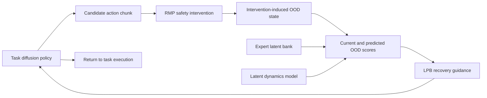

# Recovery-Aware LPB for RMP-Induced OOD States

Research code for detecting states created by reactive safety interventions and guiding an RB10 manipulator back toward task-relevant behavior.

**Reported result:** recovery-aware LPB completed **146 of 160 RB10 trials (91.3%)** in the evaluated intervention setting. The manuscript and broader evaluation are in preparation.

[Research portfolio](https://cheesss.github.io/research/recovery-aware-lpb/) · [Implementation map](./OOD_CHANGE_LOG.md) · [Diffusion Policy](https://diffusion-policy.cs.columbia.edu/)

## Research question

A reactive motion policy can keep a robot away from an obstacle, but the intervention may move the robot outside the state distribution represented by its demonstrations. Once control returns to the learned task policy, that policy may not know how to recover.

This project asks:

> Can a policy bridge detect intervention-induced out-of-distribution states and steer the learned policy back toward demonstrated task behavior?

## Reported evaluation

| Method | Task success | Scope |
| --- | ---: | --- |
| Base policy | 25.0% | No recovery-specific adaptation |
| Policy fine-tuning | 63.8% | Direct adaptation baseline |
| Original LPB | 64.4% | Policy-bridge baseline |
| **Recovery-aware LPB** | **91.3% (146/160)** | Same reported intervention setting |

These values summarize the current RB10 evaluation. Per-condition records, checkpoints, and the finalized protocol will accompany the manuscript; they are not included in this public repository.

## System overview

The public code covers the OOD monitoring and latent-dynamics path used to study this recovery mechanism. The full experimental branch remains private while the manuscript is in preparation.

## What I added

This repository started from the open-source Diffusion Policy codebase. The project-specific additions are separated from the upstream implementation and summarized below.

| Component | Purpose |
| --- | --- |
| `rb10_eval_real_robot_ood.py` | RB10 inference entry point with OOD monitoring and runtime validation |
| `diffusion_policy/real_world/ood_monitor.py` | Current and predicted OOD scoring against expert latent support |
| `diffusion_policy/common/ood_utils.py` | Observation encoding, nearest-neighbor distance, and score normalization |
| `diffusion_policy/model/ood/latent_dynamics_model.py` | Future-latent prediction conditioned on the current state and action horizon |
| `diffusion_policy/workspace/train_ood_dynamics_workspace.py` | Training workspace for the latent dynamics model |
| `diffusion_policy/dataset/son_replay_ood_dynamics_dataset.py` | Expert and rollout HDF5 conversion for dynamics training |
| `diffusion_policy/scripts/export_ood_assets.py` | Expert latent-bank export using the frozen task-policy encoder |
| `diffusion_policy/config/son_train_ood_dynamics_real_workspace.yaml` | OOD-dynamics training configuration |
| `diffusion_policy/config/son_export_ood_assets.yaml` | Latent-bank export configuration |

See [OOD_CHANGE_LOG.md](./OOD_CHANGE_LOG.md) for the implementation-level map.

## Research workflow

1. Train the visual diffusion policy on expert demonstrations.
2. Encode expert observations into a latent reference bank.
3. Collect policy rollout data, including intervention-induced states.
4. Train a latent dynamics model to predict future representation drift.
5. Compute current and predicted OOD scores during RB10 inference.
6. Apply recovery guidance when the intervention moves the robot outside demonstrated support.

## Public repository scope

Included:

- OOD monitoring and visualization code
- latent-bank export utilities
- latent-dynamics model and training workspace
- RB10 research integration scaffolding
- configuration files for the public research path

Not included:

- robot demonstration and rollout datasets
- trained policy, dynamics, or LPB checkpoints
- unpublished per-condition trial records
- the full private experimental branch used for the manuscript

Code and additional materials are available to research collaborators upon request.

## Status and limitations

- **Status:** manuscript in preparation
- The reported result is specific to the evaluated task distribution and intervention protocol.
- This repository is a research snapshot, not a turn-key benchmark release.
- Hardware-specific paths and checkpoints must be configured before real-robot execution.

## Upstream work and attribution

This research repository is built on [Diffusion Policy](https://github.com/real-stanford/diffusion_policy):

> Cheng Chi et al., “Diffusion Policy: Visuomotor Policy Learning via Action Diffusion,” *Robotics: Science and Systems*, 2023.

The upstream license is retained in [LICENSE](./LICENSE). Project-specific claims and experimental results in this README refer to Hyeonjun Cho's research extension, not to the upstream authors.

## Contact

Hyeonjun Cho · Sungkyunkwan University

[Research portfolio](https://cheesss.github.io/) · [GitHub](https://github.com/cheesss)
