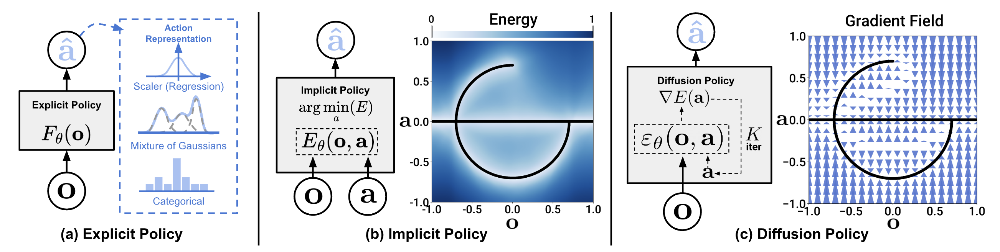
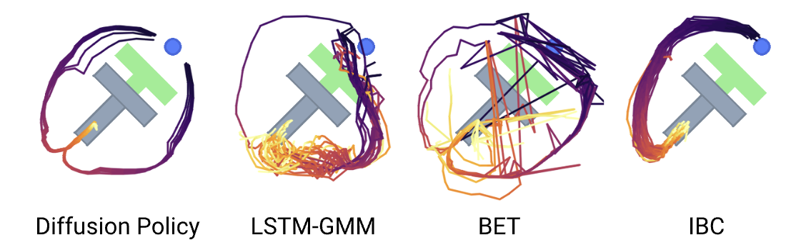

# Diffusion Policy

[[Project page]](https://diffusion-policy.cs.columbia.edu/)
[[Paper]](https://diffusion-policy.cs.columbia.edu/#paper)
[[Data]](https://diffusion-policy.cs.columbia.edu/data/)
[[Colab (state)]](https://colab.research.google.com/drive/1gxdkgRVfM55zihY9TFLja97cSVZOZq2B?usp=sharing)
[[Colab (vision)]](https://colab.research.google.com/drive/18GIHeOQ5DyjMN8iIRZL2EKZ0745NLIpg?usp=sharing)


[Cheng Chi](http://cheng-chi.github.io/)<sup>1</sup>,
[Siyuan Feng](https://www.cs.cmu.edu/~sfeng/)<sup>2</sup>,
[Yilun Du](https://yilundu.github.io/)<sup>3</sup>,
[Zhenjia Xu](https://www.zhenjiaxu.com/)<sup>1</sup>,
[Eric Cousineau](https://www.eacousineau.com/)<sup>2</sup>,
[Benjamin Burchfiel](http://www.benburchfiel.com/)<sup>2</sup>,
[Shuran Song](https://www.cs.columbia.edu/~shurans/)<sup>1</sup>

<sup>1</sup>Columbia University,
<sup>2</sup>Toyota Research Institute,
<sup>3</sup>MIT




## 🛝 Try it out!
Our self-contained Google Colab notebooks is the easiest way to play with Diffusion Policy. We provide separate notebooks for  [state-based environment](https://colab.research.google.com/drive/1gxdkgRVfM55zihY9TFLja97cSVZOZq2B?usp=sharing) and [vision-based environment](https://colab.research.google.com/drive/18GIHeOQ5DyjMN8iIRZL2EKZ0745NLIpg?usp=sharing).


## 🛠️ Installation
### 🖥️ Simulation
To reproduce our simulation benchmark results, install our conda environment on a Linux machine with Nvidia GPU. On Ubuntu 20.04 you need to install the following apt packages for mujoco:
```console
$ sudo apt install -y libosmesa6-dev libgl1-mesa-glx libglfw3 patchelf
```

We recommend [Mambaforge](https://github.com/conda-forge/miniforge#mambaforge) instead of the standard anaconda distribution for faster installation: 
```console
$ mamba env create -f conda_environment.yaml
```

but you can use conda as well: 
```console
$ conda env create -f conda_environment.yaml
```

The `conda_environment_macos.yaml` file is only for development on MacOS and does not have full support for benchmarks.

### 🦾 Real Robot
Hardware (for Push-T):
* 1x RB10
* 1x D405, D435I
* 1x VR tracker (for teleop)


Software:
* Ubuntu 20.04.3 (tested)


## 🖥️ Reproducing Simulation Benchmark Results 
### Download Training Data
Under the repo root, create data subdirectory:
```console
[diffusion_policy]$ mkdir data && cd data
```

Download the corresponding zip file from [https://diffusion-policy.cs.columbia.edu/data/training/](https://diffusion-policy.cs.columbia.edu/data/training/)
```console
[data]$ wget https://diffusion-policy.cs.columbia.edu/data/training/pusht.zip
```

Extract training data:
```console
[data]$ unzip pusht.zip && rm -f pusht.zip && cd ..
```

Grab config file for the corresponding experiment:
```console
[diffusion_policy]$ wget -O image_pusht_diffusion_policy_cnn.yaml https://diffusion-policy.cs.columbia.edu/data/experiments/image/pusht/diffusion_policy_cnn/config.yaml
```

### Running for a single seed
Activate conda environment and login to [wandb](https://wandb.ai) (if you haven't already).
```console
[diffusion_policy]$ conda activate robodiff
(robodiff)[diffusion_policy]$ wandb login
```

Launch training with seed 42 on GPU 0.
```console
(robodiff)[diffusion_policy]$ python train.py --config-dir=. --config-name=image_pusht_diffusion_policy_cnn.yaml training.seed=42 training.device=cuda:0 hydra.run.dir='data/outputs/${now:%Y.%m.%d}/${now:%H.%M.%S}_${name}_${task_name}'
```

This will create a directory in format `data/outputs/yyyy.mm.dd/hh.mm.ss_<method_name>_<task_name>` where configs, logs and checkpoints are written to. The policy will be evaluated every 50 epochs with the success rate logged as `test/mean_score` on wandb, as well as videos for some rollouts.
```console
(robodiff)[diffusion_policy]$ tree data/outputs/2023.03.01/20.02.03_train_diffusion_unet_hybrid_pusht_image -I wandb
data/outputs/2023.03.01/20.02.03_train_diffusion_unet_hybrid_pusht_image
├── checkpoints
│   ├── epoch=0000-test_mean_score=0.134.ckpt
│   └── latest.ckpt
├── .hydra
│   ├── config.yaml
│   ├── hydra.yaml
│   └── overrides.yaml
├── logs.json.txt
├── media
│   ├── 2k5u6wli.mp4
│   ├── 2kvovxms.mp4
│   ├── 2pxd9f6b.mp4
│   ├── 2q5gjt5f.mp4
│   ├── 2sawbf6m.mp4
│   └── 538ubl79.mp4
└── train.log

3 directories, 13 files
```


## 🦾 Demo, Training and Eval on a Real Robot

Make hdf5 dataset for RB10 robot. Press 's' to start saving data and 'q' to quit. Then, a prompt will appear asking whether to save this demo data: y/n. When you have collected the desired number of demos, press 't' to terminate.

```console
(robodiff)[diffusion_policy]$ python bae_hdf_maker_abs.py
```
Data format
```console
data
 - demo_0
   - obs
     - robot_eef_pos (3)
     - robot_eef_quat (4)
     - image0 (240, 320)
     - image1 (240, 320)
   - actions (9)
 
 - demo_1
   ...
```


Train a Diffusion Policy. You can train on various tasks and settings by specifying different configurations. And you can also adjust hyperparameters or dataset in config.


```console
(robodiff)[diffusion_policy]$ python train.py --config-name=bae_train_diffusion_transformer_real_hybrid_workspace task=bae_push_image_abs
```


Assuming the training has finished and you have a checkpoint at `data/outputs/blah/checkpoints/latest.ckpt`, launch the evaluation script with:

```console
python bae_eval_real_robot.py --input data/outputs/blah/checkpoints/latest.ckpt --output data/results
```

## Simulation Scheduled Eval Entry

Added local simulation entrypoint:

- `eval_sim_scheduled.py`

Added helper modules:

- `diffusion_policy/sim_world/sim_env_adapter_son_adv.py`
- `diffusion_policy/sim_world/sim_obs_sync.py`
- `diffusion_policy/sim_world/sim_action_scheduler.py`
- `diffusion_policy/sim_world/sim_eval_metrics.py`

Environment note:

- This implementation uses installed `robosuite` / `robomimic` from the active conda env.
- Conda env hotfix applied on Windows (`idp_robodiff`) to fix `robosuite` import:
  - copied
    `C:\Users\chohj\anaconda3\envs\idp_robodiff\Lib\site-packages\mujoco\mujoco.dll`
    ->
    `C:\Users\chohj\anaconda3\envs\idp_robodiff\Lib\site-packages\robosuite\utils\mujoco.dll`

Run:

```bash
python eval_sim_scheduled.py --input <ckpt> --output <out_dir> --task son_pick_and_place_image_adv
```

Absolute-action bridge:

- If policy outputs absolute `10D` action (`xyz + rot6d + gripper_abs`), `eval_sim_scheduled.py` now converts it to OSC `7D` delta command before `env.step(...)`.
- Position / rotation command scaling uses:
  - `--osc_pos_output_max` (default `0.05`)
  - `--osc_rot_output_max` (default `0.5`)
- Gripper mapping can be toggled with:
  - `--binarize_gripper` (default) or `--continuous_gripper`
